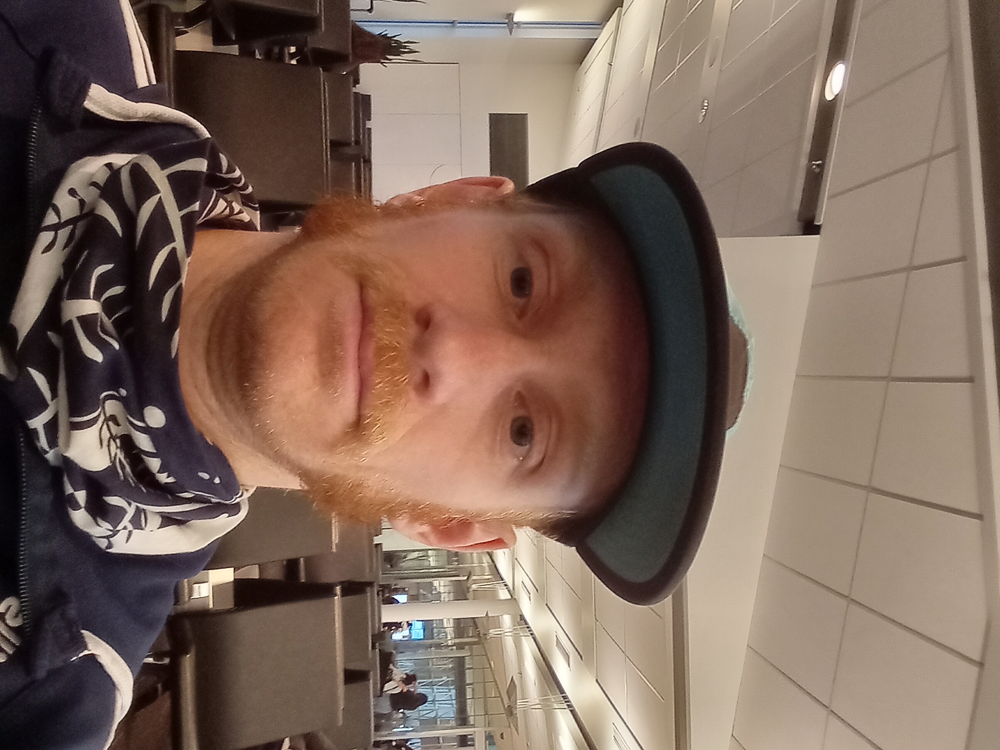

<html lang="en">
<head>
    <title>Antoine Abram</title>
    
	
</head>
<body onload = "startTimer()">
	

        <a href="Accueil">Français</a>
        <a href="CV-Anglais">CV</a>
        <a href="Enseignement-En">Teaching</a>
        <a href="Recherche-En">Research</a>
        <a href="Accueil-En">Home</a>
        <h1>Antoine&nbsp;Abram</h1>
    

    

    	

        	

        	    

	I am a PhD student at UQÀM in the Laboratory of Algebra, Combinatorics, and Mathematical Computing (LACIM) under the direction of Christophe Reutenauer. 
				

				

	I obtained my bachelor's degree as well as my master's degree at UQÀM also under the direction of Christophe Reutenauer; you don't change a winning team!
				

				<h4>
	Research interests:
				</h4>
				

	My research are in enumerative and algebraic combinatorics. I have a strong interest in monoids defined by means of insertions, like the plactic monoid or the sylvester monoid, and their associated algebras.
				

				

	Here is a list of other topics in which I also have a great interest: 
					<ul style="list-style-type:disc;">
						<li>Automata, language theory and combinatorics on words;</li>
	  					<li>Coxeter groups; their arrangements of hyperplanes, root systems and associated polytopes such as permutahedrons;</li>
						<li>partially ordered sets, lattices and their associated polytopes;</li>
					</ul>
				

				<h3>
				---  Being in the last year of my PhD, I am currently looking for a job for next year.  ---
				</h3>
				

	Contact: abram.antoine (at) courrier.uqam.ca
				

	        

    	

    	

			
    	

	

