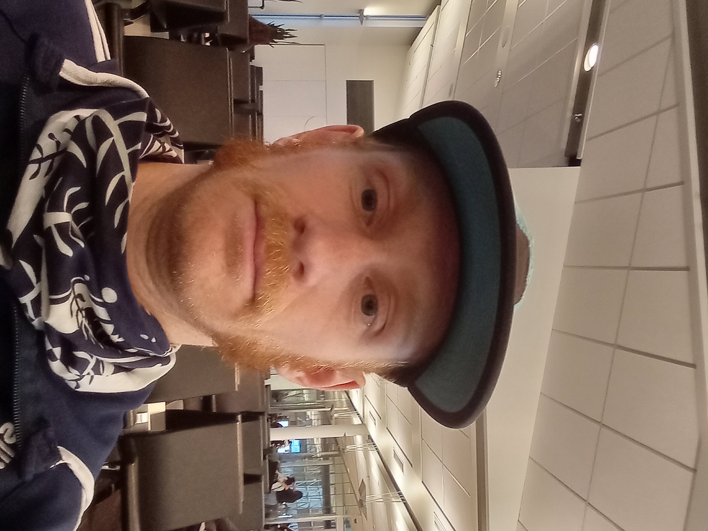

<!DOCTYPE HTML>
<html lang="fr">
<head>
    <title>Antoine Abram</title>
    
    
</head>
<body onload = "startTimer()">
    

        <a href="Accueil-En">English</a>
        <a href="CV-Francais">CV</a>
        <a href="Enseignement">Enseignement</a>
        <a href="Recherche">Recherche</a>
        <a href="Accueil">Accueil</a>
        <h1>Antoine Abram</h1>
    

    

    

        

            

	Je suis un étudiant au doctorat à l'UQÀM dans le Laboratoire d'Algèbre, de Combinatoire, et d'Informatique Mathématique (LACIM) sous la direction de Christophe Reutenauer.
	

	

	J'ai obtenu mon baccalauréat ainsi que ma maitrise à l'UQÀM aussi sous la tutelle de Christophe Reutenauer; on ne change pas une équipe gagnante!
	

	<h4>
	Intérêts en recherche:
	</h4>
	

	Ma recherche est principalement en combinatoire énumérative et algébrique.
	J'aime bien les monoïdes issues d'objets combinatoires, comme le monoïde plaxique ou le monoïde sylvestre et les algèbres qui y sont associées.
	

	

	Voici d'autres sujets pour lesquels j'ai aussi un grand intérêt: 
	<ul style="list-style-type:disc;">
	  <li>les automates, la théorie des langages et la combinatoire des mots;</li>
	  <li>les groupes de Coxeter; leurs arrangements d'hyperplans, systèmes de racines et les polytopes associés comme les permutohèdres;</li>
	  <li>les ensembles partiellements ordonnés, treillis et leurs polytopes associés;</li>
	</ul>
	

	<h3>
	---  Étant en dernière année de doctorat, je suis présentement à la recherche d'un emploi pour l'année prochaine.  ---
	</h3>
	

	Contact: abram.antoine (at) courrier.uqam.ca
	

        

    

    

	  
    

</body>
</html>
